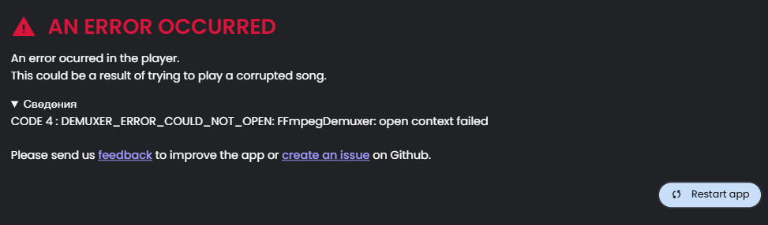

# Nora - CMR Fork

This is a custom fork of the Nora music player that fixes the most annoying FLAC playback issues and brings significant stability improvements.

## The Infamous FLAC / Demuxer Crash

If you've encountered a sudden playback crash ("An error occurred") when playing high-quality FLAC or MP3 files, it is highly likely due to a Chromium demuxer crash:



#### The Root Cause
Nora uses `node-taglib-sharp` to read metadata (tags, album covers) from audio files. Sometimes, audio files contain embedded pictures with an empty or undefined MIME type field (either due to improper tag editing, encoding bugs, or different tag formats). 

When Chromium attempts to load and demux the audio stream containing an image with a missing or null MIME descriptor, the native multimedia pipeline gets corrupted, throwing a fatal **`DEMUXER_ERROR_COULD_NOT_OPEN`** exception. This instantly kills the audio channel and crashes the player UI.

#### The Auto-Heal Fix
In this fork, I implemented a proactive Auto-Healing system inside the main process song parser (`src/main/parseSong/parseSong.ts` & `reParseSong.ts`):

```typescript
// Auto-heal empty MIME types in pictures (fixes Chromium DEMUXER_ERROR_COULD_NOT_OPEN)
if (file.tag && file.tag.pictures && file.tag.pictures.length > 0) {
  let needsSave = false;
  for (const pic of file.tag.pictures) {
    if (!pic.mimeType || pic.mimeType.trim() === '') {
      pic.mimeType = 'image/jpeg';
      needsSave = true;
      logger.info(`Auto-healed empty MIME type for picture.`, { absoluteFilePath });
    }
  }
  if (needsSave) file.save();
}
```

* **How it works:** When Nora parses a song, it inspects the embedded pictures array. If any image tag has an empty, missing, or whitespace-only `mimeType`, Nora automatically fixes it by writing `'image/jpeg'` as the default MIME type and immediately saves the tags back to the file using `file.save()`.
* **The Result:** The file tags are permanently repaired, and Chromium can safely load the image and play the music without throwing any demuxer errors.