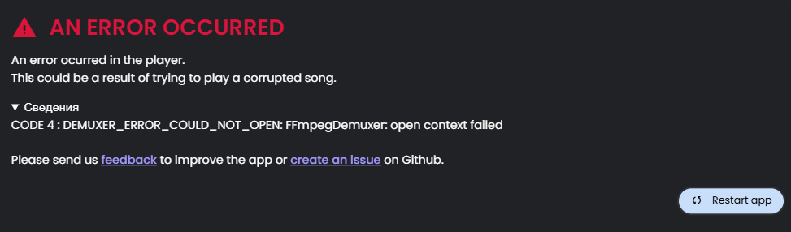

# Nora — CMR Fork

My personal fork of [Nora](https://github.com/Sandakan/Nora).

It started as a one-line fix for a crash and grew from there. The fork still sits on Nora `v3.1.0`, but by now it has a proper set of additions on top - a built-in tier-list maker, a smart shuffle that actually uses your rankings, portable listening stats, ELO song duels, and a handful of fixes I wanted out of the player.

---

## The crash that started this

If Nora ever died with "An error occurred" on a high-quality FLAC (or some MP3s), this was it:



Nora reads album art out of the file's tags. Some files have an embedded picture with an **empty MIME type** usually from bad tag editors or weird encoders. When Chromium tries to demux a track whose cover has no MIME type, it throws `DEMUXER_ERROR_COULD_NOT_OPEN` and kills playback.

The fix: before playing, if a picture's MIME type is blank, set it to `image/jpeg` and write it back.

```typescript
// Fixes Chromium DEMUXER_ERROR_COULD_NOT_OPEN
if (file.tag?.pictures?.length > 0) {
  let needsSave = false;
  for (const pic of file.tag.pictures) {
    if (!pic.mimeType || pic.mimeType.trim() === '') {
      pic.mimeType = 'image/jpeg';
      needsSave = true;
    }
  }
  if (needsSave) file.save();
}
```

It runs in the song parser (`src/main/parseSong/`), so a file gets healed on first scan and the repair is saved to disk - fixed once, then fine.

Stock `v3.1.0` can't edit FLAC tags (it only reads them with `music-metadata` and edits MP3s with `node-id3`). I'd written this for the unreleased `v4` alpha, but that branch was too unstable to use, so I pulled `node-taglib-sharp` into `v3.1.0` by hand and backported the fix here.

---

## Tierlists

I used to rank my music in a separate web app and got tired of it living outside the player, so I built a tier-list maker into Nora, new tab next to Genres.

- The **image pool comes from your playlists, live**. Pick one or more playlists as the source; their tracks show up as cards, covers and all. Add a song to the playlist, it appears in the pool.
- **S / A / B / C / D / E / F** tiers in the original tiermaker colors. Rename / add / remove rows.
- Drag and drop, auto-scroll near the edges, right-click for play / song info / artist.
- Hover **play button** on cards to audition while ranking.
- Captions show **track** or **artist - track**.
- **Export to PNG.**
- Handles thousands of tracks fine - covers are cached thumbnails and off-screen cards aren't decoded.

Tier lists are stored in their own `tierlists.json`, separate from everything else, so updates won't touch your library or lose your rankings.

---

## Smart Shuffle (Tierlist Value Shuffle)

A second shuffle mode (the magic-wand button by the normal one) that weights the order toward music you actually rate:

- Higher-ranked tracks come up more (S over F).
- Artists get a boost from how high **and** how many of their tracks you've ranked - so a song that isn't in any tier list can still surface because it's by someone you clearly love.
- Listening counts nudge it a bit.
- Recently played tracks get pushed back, so it doesn't loop the same handful at you.

It's about **60% smart / 40% random** - leans, doesn't rig. Only tier lists you mark as "influencing" count, and it won't turn on if none are. Like the normal shuffle, it reorders your current queue and keeps the playing track, so you stay in the same context. The two shuffles are mutually exclusive.

---

## Volume that actually sounds smooth

The stock volume slider is **linear** - it just sets the audio gain to `value / 100`. Problem is, your ears aren't linear, they hear loudness on a logarithmic (decibel) scale. So on the old slider almost all the audible change was crammed into the bottom, and the top half sounded basically the same. It felt like the volume jumped in chunks instead of gliding.

Now it uses a proper **perceptual (dB) curve**, the same kind of taper the Windows volume mixer uses, so loudness rises evenly across the whole slider. The number is still 0-100; only how it maps to real gain changed (50% now sits around -16 dB instead of a flat half). The slider is also wider, so you can actually land on the value you want.

---

## Stats, finally

A new **Stats** tab with your listening numbers: total listens, full listens, skips, approximate listening time, switchable all-time / last-12-month / last-30-day views, a monthly or daily activity graph, top songs / artists / albums / genres, most skipped, and your ELO standings.

It also does **portable stats**. Export your listening history and ELO ratings to a JSON file and merge them into another library - or import a stock "Nora exports" folder from vanilla Nora, that works too. Song ids and folder paths can be different between installs, so the importer recognizes tracks by metadata fingerprints (file name, title + artists, duration) and merges day by day, never by raw ids or timestamps.

There are two merge modes: **add the numbers together** for devices used separately, or **take the maximum** when the data originally came from the same library so nothing gets double-counted. A backup of your current stats files is written before every import, malformed exports are rejected before anything is changed, and importing the same additive export twice won't duplicate it.

The old app-data export in Settings is still there for a different job: it is a full backup / restore of the library, playlists, covers and settings. It now includes CMR stats and ELO too, while older "Nora exports" folders stay compatible.

## ELO duels

The **Duel** button above Settings is always there when you want it: two songs from your listening history side by side, pick the one you like more, and the next duel follows automatically. Standard ELO math - everyone starts at 1200, K=32. Cards have hover preview buttons that play a snippet of the song without touching your queue or the main player.

Nora can also build up a small duel backlog as you listen. The frequency is configurable in Settings, the queue persists across restarts, and it is capped at 100. The duel window can be minimized without losing the current pair or the rest of the batch.

Your top-rated songs and recent duels live on the Stats tab from the very first result. And once you've done ten or so duels, the Smart Shuffle starts using your ratings as a fourth signal - songs that have never dueled stay neutral, so not playing along never hurts a track.

## Sticky selection

Multi-select no longer evaporates when you switch tabs or finish an action. Select songs, wander around the app, then do the thing. It clears with **Esc**, the **Unselect** button in the top bar, or actions that actually remove the selected items - and it never mixes songs with playlists.

---

## Credits

Built on [Nora](https://github.com/Sandakan/Nora) by [Sandakan](https://github.com/Sandakan).

Built for my own daily use. Auto-updates pull from this fork's own GitHub releases, not upstream, so they only ever ship my changes.
